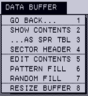

# NeoWidEx


NeoWidEx is a formatting and diagnostic utility for the Widget, a 10-megabyte
hard drive that Apple Computer designed and manufactured the 1980s. It runs on
the Apple Lisa 2/10 computer, the only computer Apple ever sold with a Widget
inside.

_Note: The current version of NeoWidEx is now 0.4, which looks nearly
identical to the screen image above._

## Fair warning

NeoWidEx can easily destroy all of the data on your Widget, quickly and
permanently. It might even harm your Widget itself, even if it is used in a
cautious and sensible way. If you're not prepared to risk these consequences,
don't use NeoWidEx.

## Required reading

NeoWidEx is a powerful tool that issues low-level commands directly to a
Widget. To use NeoWidEx effectively, you need to know how a Widget works and
what these commands do.

The documentation that comes with NeoWidEx will not give you this knowledge on
its own. Get ready to use NeoWidEx by studying the [Widget ERS document](
http://bitsavers.trailing-edge.com/pdf/apple/disk/widget/Widget_ERS.pdf),
particularly PDF pages 81-135.

## Table of contents

_All items prefixed with a star (:star:) describe functionality compatible with
any drive that supports the ProFile drive protocol._

* [System requirements](#system-requirements)
  - [Details](#details)
* [User interface notes](#user-interface-notes)
  - [Accessibility](#accessibility)
  - [Hexadecimal numbers](#hexadecimal-numbers)
  - [Forms](#forms)
* [Forcing "detection" of a Widget](#forcing-detection-of-a-widget)
* [Main menu options](#main-menu-options)

   [:star: LAST STATUS](#star-last-status),
   [:star: BUFFER...](#star-buffer),
   [:star: DRIVE INFO](#star-drive-info),
   [:star: SPARE TABLE](#star-spare-table),
   [FULL STATUS](#full-status),
   [SERVO STATUS](#servo-status),
   [ABORT STATUS](#abort-status),
   [SET RECOVERY](#set-recovery),
   [:star: GENERIC READ](#star-generic-read),
   [:star: GENERIC WRITE](#star-generic-write),
   [WIDGET READ](#widget-read),
   [WIDGET WRITE](#widget-write),
   [SEND RESTORE](#send-restore),
   [SEEK](#seek),
   [AUTOOFFSET](#autooffset),
   [READ AT SEEK](#read-at-seek),
   [WRITE AT SEEK](#write-at-seek),
   [READ HEADER](#read-header),
   [SCAN](#scan),
   [SOFT RESET](#soft-reset),
   [RESET SERVO](#reset-servo),
   [PARK HEADS](#park-heads),
   [INIT SPR TBL](#init-spr-tbl),
   [FORMAT TRACK](#format-track),
   [:star: UTILITIES...](#star-utilities),
   [:star: QUIT](#star-quit),
   [:star: THANKS](#star-thanks)

* [Buffer submenu options](#buffer-submenu-options)

   [:star: SHOW CONTENTS](#star-show-contents),
   [:star: ...AS SPR TBL](#star-as-spr-tbl),
   [:star: SECTOR HEADER](#star-sector-header),
   [:star: EDIT CONTENTS](#star-edit-contents),
   [:star: PATTERN FILL](#star-pattern-fill),
   [:star: RANDOM FILL](#star-random-fill),
   [:star: RESIZE BUFFER](#star-resize-buffer)

* [Utilities submenu options](#utilities-submenu-options)

   [GREP SECTORS](#grep-sectors),
   [:star: GREP BLOCKS](#star-grep-blocks),
   [:star: EXERCISE DISK](#star-exercise-disk),
   [TRACK OFFSETS](#track-offsets),
   [FORMAT](#format),
   [:star: ADDRESSING...](#star-addressing)

* [Acknowledgements](#acknowledgements)

## System requirements

You can get started right away with NeoWidEx if you have:

- A working floppy drive (or a floppy drive emulator like [Floppy Emu](
  http://www.bigmessowires.com/floppy-emu/)).
- A Lisa 2 with ROM version H.

NeoWidEx will run on a Lisa 2/5---that is, a Lisa 2 with a built-in external
parallel port---but it will only be able to access drives attached to that
port. Most NeoWidEx options will be unavailable unless that drive is a Widget,
or unless you force NeoWidEx to treat the drive as a Widget (see [Forcing
"detection" of a Widget](#forcing-detection-of-a-widget) below).

The [LisaEm](http://lisa.sunder.net) emulator will run NeoWidEx, although
because LisaEm does not emulate a Widget, many options will be unavailable.

#### Details

**Floppy drive:** Ordinary realisations of NeoWidEx will be loaded into RAM
from a floppy disk (or from a floppy drive emulator like Floppy Emu). Other
methods of starting NeoWidEx may be possible but have not been attempted.
NeoWidEx expects the Lisa's memory to be configured [as the Boot ROM arranges
it on startup](https://github.com/stepleton/bootloader#operational-description),
and NeoWidEx itself should be loaded into a contiguous memory region starting
at address `$000800`. NeoWidEx's code is not relocatable.

**ROM version H:** NeoWidEx performs some tasks by calling unpublished routines
in the Lisa's boot ROM. For this reason, a NeoWidEx built for one boot ROM
version will not work in a Lisa with a different boot ROM. At present. NeoWidEx
is developed on a Lisa with boot ROM version H, and the disk image available on
Github is ROM H specific.

If you know where to find the ROM routines NeoWidEx uses in a different ROM
version, and you know these ROM routines work the same way that their ROM H
counterparts do, all you'll need to do to make a custom NeoWidEx for your
ROM is

- change the `kBootRom` constant in [`NeoWidEx_DEFS.X68`](
  NeoWidEx_DEFS.X68).
- supply the addresses in a ROM-specific section of the same file (copy the
  idiom found within the `IFEQ (kBootRom-'H')` conditional.

## User interface notes

### Accessibility

NeoWidEx has poor accessibility for people with certain kinds of visual
impairments. Additionally, some people may have trouble reading the text
NeoWidEx prints to the screen, since NeoWidEx uses the capital-letters-only
font in the Lisa's boot ROM. Other shortcomings may exist.

If you are having trouble using NeoWidEx due to any of its accessibility
limitations, please [contact me via email](mailto:stepleton@gmail.com).

### Hexadecimal numbers

:point_right:
**All numbers displayed in NeoWidEx are hexadecimal numbers.**
:point_left:

### Forms

NeoWidEx uses forms to obtain numerical input from the user. A form is one or
more lines of text that look like this:

```
SEEK TO CYLINDER-⍰⍰⍰⍰ HEAD-01 SECTOR-0C
```

At any time when a form is active, the user may change the value for the field
marked with inverted question mark characters (drawn as `⍰` above). The user
edits this value in an input box above the output window, where the arrow keys,
**Backspace**, and digits 0-9, A-F all work as expected. Typing **Tab** or
**Return** commits the edited value to the field and moves to the next field,
rotating back to the start after the end of the form is reached.

Type **Clear** or **Z** to restore the value in the current field to the value
it had when the form was initially presented.

Type **Q** to abandon the form and cancel the operation currently underway.

And finally, type **Enter** or **X** to submit the form and continue the
operation in progress.

## Forcing "detection" of a Widget

The first time you select one of the Widget-specific menu options, NeoWidEx
attempts to verify that a Widget is present by reading and parsing the hard
drive's "identity block" at logical address `$FFFFFF`. If this investigation
cannot determine that the hard drive is a Widget---for example, it won't work
on a real Widget that failed its power-on self tests---NeoWidEx asks if you
would like to override the failed verification and "pretend" that a working
Widget is installed. If you choose to do this, NeoWidEx proceeds as if it were
communicating with a standard 10 MB Widget; otherwise, it aborts the operation
in progress.

A Widget that fails its self tests may still be able to respond to various
Widget-specific commands, so forcing NeoWidEx to operate this way may help in
troubleshooting a broken drive. (The several drive status menu options may be
especially useful.)

:warning: Non-Widget drives may respond to Widget commands in unexpected and
undesirable ways. Data loss, device damage, or more mundane effects like
crashing NeoWidEx cannot be ruled out. Consider overriding Widget detection
only when an actual Widget is connected to your Lisa.

NeoWidEx will continue to "pretend" that a working Widget is present until it
refreshes its cached information about the drive. The [DRIVE INFO](
#star-drive-info) menu option forces this refresh to occur; additionally, some
menu options may also force this refresh if they detect that the Widget has
updated its spare table.

## Main menu options


The NeoWidEx main menu presents the following menu options. The ones marked with
a star (:star:) are compatible with all Lisa parallel port hard drives.

#### :star: LAST STATUS

NeoWidEx presents the last **standard status** reported by the hard drive, along
with a bit-by-bit explanation of what the status means.

#### :star: BUFFER...

This menu option leads to [the Buffer submenu](#buffer-submenu-options).

#### :star: DRIVE INFO

NeoWidEx reads block `$FFFFFF` from the drive, a "virtual block" that contains
information about the drive's parameters (its "`Device_ID`" structure).
NeoWidEx parses and presents this data.

This command will not work on a Widget that has failed its self tests. It will
also cancel any override of NeoWidEx's failure to detect a Widget drive. See
[Forcing "detection" of a Widget](#forcing-detection-of-a-widget) for more
details.

#### :star: SPARE TABLE

NeoWidEx reads block `$FFFFFE` from the drive, a "virtual block" that returns a
data structure describing the drive's **spare table** (in Widget's case at
least, this is the actual spare table data stored on disk). NeoWidEx parses and
presents the information in this data structure.

Within the LisaEm emulator, it is normal for NeoWidEx to observe that the
bad block table ends with a suspicious `$000000` value instead of the
expected `$FFFFFF`.

This command will not work on a Widget that has failed its self tests.

#### FULL STATUS

NeoWidEx issues the `Read_Controller_Status` command repeatedly to recover
all eight 32-bit controller status longwords from the Widget. It displays these
longwords along with a bit-by-bit explanation of what the longwords mean. The
first status longword is the standard status.

#### SERVO STATUS

NeoWidEx issues the `Read_Servo_Status` command repeatedly to recover all
eight 32-bit status longwords from the servo. These longwords are requested in
the reverse order of their identifying bytes, from `$08` to `$01`. This ensures
that status information pertaining to the last command processed by the servo
(servo status longword `$08`) won't simply refer to the commands executed to
retrieve the other seven status longwords.

NeoWidEx displays these longwords and attempts to show a bit-by-bit explanation
of what they mean, but the semantics of the servo status information are not
as well-documented or well-known as those of the controller status longwords.

#### ABORT STATUS

NeoWidEx issues the `Read_Abort_Status` command, whose result elaborates on the
failure condition encountered by the Widget while carrying out the last command
to be executed. If there was no preceding failure condition (marked by the
least significant bit of the first byte of the standard status), then the
returned information is not meaningful.

NeoWidEx attempts to decode the abort status information based on Appendix C of
the [Widget ERS document](
http://bitsavers.trailing-edge.com/pdf/apple/disk/widget/Widget_ERS.pdf), which
notes that the proper interpretation of this data is highly dependent on the
Widget's firmware version. As the ERS document appears to describe an earlier
firmware than what's available on my Widget, it's quite possible that
NeoWidEx will not interpret abort status information correctly for most
commercially-sold Widgets.

#### SET RECOVERY

This option allows the user to enable or disable the Widget's **recovery**
capability (via the `Set_Recovery` command). With recovery enabled (the
default), the Widget will attempt to compensate for certain errors encountered
whilst carrying out a command: for example, if it fails to write data to a
particular block, the Widget will save the data in one of the Widget's spare
blocks instead. With recovery disabled, operations that encounter errors will
abort without attempting any kind of work-around.

Most serious diagnostic investigations will disable recovery to obtain more
precise control over the behaviour and side-effects of Widget commands.

#### :star: GENERIC READ

NeoWidEx reads a user-specified block from the hard drive using the ProFile
`Read` command. The data read from the drive will be read to the disk data
memory buffer, which can be examined with the utilities available in the
[BUFFER... submenu](#buffer-submenu-options).

This command will not work on a Widget that has failed its self tests.

#### :star: GENERIC WRITE

NeoWidEx uses the ProFile `Write` command to write the contents of the disk
data memory buffer to a user-specified block on the hard drive.

This command will not work on a Widget that has failed its self tests.

#### WIDGET READ

:x: This option is not implemented yet. :x:

NeoWidEx reads a user-specified contiguous range of blocks from the Widget
using the `Sys_Read` command. The data read from the drive will be read to the
disk data buffer, which can be examined with the utilities available in the
[BUFFER... submenu](#buffer-submenu-options).

This command will not work on a Widget that has failed its self tests.

#### WIDGET WRITE

:x: This option is not implemented yet. :x:

NeoWidEx uses the `Sys_Write` command to write multiple blocks' worth of data
from the disk data memory buffer to a user-specified contiguous range of
blocks on the Widget.

This command will not work on a Widget that has failed its self tests.

#### SEND RESTORE

This option uses the `Send_Restore` command to cause the Widget to perform
a data or a format recalibration. This operation initialises the servo and
moves the heads to a known location over the disk surface.

#### SEEK

NeoWidEx issues a `Send_Seek` command to move the Widget's heads to a
user-specified cylinder, and to indicate that a particular head and sector
may be used for a diagnostic read or write command to follow.

#### AUTOOFFSET

NeoWidEx issues the `Set_AutoOffset` command, which directs the Widget to
fine-tune the location of the heads over the current track. (Widget has two
mechanisms for head positioning: a coarse adjustment that employs an optical
signal and a fine adjustment that uses an alignment signal stored on the
physical media itself. This second signal is the one used by the
`Set_AutoOffset` command.)

#### READ AT SEEK

NeoWidEx issues the `Diag_Read` command, which directs the Widget to load data
from the sector at the cylinder/head/sector address from the Widget's last
seek. This option also allows the user to specify a new seek location before
the read takes place.

This option may be used to read data from any sector on the disk, including
those used to store spare tables and spare blocks.

The data read from the drive will be read to the disk data memory buffer,
which can be examined with the utilities available in the [BUFFER... submenu](
#buffer-submenu-options).

#### WRITE AT SEEK

NeoWidEx uses the `Diag_Write` command to write the contents of the disk data
memory buffer to the sector at the cylinder/head/sector address from the
Widget's last seek. This option also allows the user to specify a new seek
location before the write takes place.

This option may be used to write data to any sector on the disk, including
those used to store spare tables and spare blocks.

:warning: Ordinary writes to Widget engage the fine head positioning mechanism
(see [AUTOOFFSET](#autooffset)) prior to committing data to the disk media.
This NeoWidEx option gives you an opportunity to engage this mechanism prior to
the write, which is generally a good idea.

#### READ HEADER

Via the `Diag_ReadHeader` command, this option allows the user to read the
header, and all the data, of any sector on the same cylinder/head of the
Widget's last seek. Like other low-level IO options, the user may specify a new
seek location prior to the read.

Headers are 13-byte strings that precede sector data on the Widget, encoding
the sector's cylinder/head/sector address. Use the [SECTOR HEADER](
#star-sector-header) option in the [BUFFER... submenu](#buffer-submenu-options)
to access facilities for viewing headers.

#### SCAN

NeoWidEx issues the `Scan` command to initiate a surface scan of the Widget's
disk media, which updates the spare table if any unreadable or
difficult-to-read blocks are detected. This is the same procedure that occurs
when the Widget powers up, producing the rapid "squeaky ticking" noise that
lasts for a few minutes.

#### SOFT RESET

NeoWidEx issues the `Soft_Reset` command to restart the Widget's controller,
which in turn causes the Widget to reinitialise its internal state, reloading
the spare table from disk. (This procedure produces the first few seconds of
seeking followed by the "squeaky squeaky!" noise observed after power-up.)
Unlike the actual behaviour on power-up, the Widget does not perform a surface
scan after squeaking.

#### RESET SERVO

NeoWidEx issues the `Reset_Servo` command to reset the Widget's servo subsystem.
It appears to be normal for the LED at the front of the Widget to go off
after the Widget executes this command.

#### PARK HEADS

NeoWidEx issues the `Send_Park` command, which orders the Widget to move the
heads to "cylinder `$235`". This location is not a real cylinder at all but
a location outside of the disk surface and (according to the ERS document)
"very near the inside diameter crash stop".

:warning: NeoWidEx will never park the Widget's heads unless this menu option
is selected. To avoid surface damage from the heads contacting the disk media,
consider using this option at the end of your NeoWidEx sessions, especially
if you think you might move your Widget (or the Lisa carrying it).

#### INIT SPR TBL

NeoWidEx issues the `Initialize_SpareTable` command with user-provided
offset and interleave parameters. The Widget writes "clean" spare table
records (indicating no bad blocks and no spare blocks in use) to both default
spare table locations: cylinder/head/sector addresses `$AF/$00/$0F` and
`$157/$01/$11`.

The offset and interleave parameters should be the same as the ones used when
the Widget was last formatted, which in most cases should be the parameters
stored in the existing spare table. This information can be recovered from the
[DRIVE INFO](#star-drive-info) option.

Prior to confirming whether you really wish to reinitialise the spare tables,
NeoWidEx displays the sequence of command bytes it will issue to the Widget,
allowing you to confirm them against the command specification in the ERS
document.

:warning: `Initialize_SpareTable` does not remove any other spare tables that
might be present on the Widget---a condition that can occur if the Widget
decides that one of the default spare table locations should itself be spared
to another spare block. After the command executes, the default locations will
be overwritten, but the "spared" spare table will still linger on disk---and
because it has a larger serial number, the Widget will still consider it
authoritative whenever it reloads the spare table.

#### FORMAT TRACK

NeoWidEx issues the `Format_Track` command with user-provided offset and
interleave parameters. This command does not format the entire disk but only
the track that is currently underneath the heads, and only the head that was
designated by the last seek. For a full drive format, use the [FORMAT](#format)
utility.

Prior to confirming whether you really wish to format the track, NeoWidEx
displays the sequence of command bytes it will issue to the Widget, allowing
you to confirm them against the command specification in the ERS document.

:warning: Using the [SEEK](#seek) and [AUTOOFFSET](#autooffset) menu options
immediately prior to FORMAT TRACK helps ensure that the formatting signal is
applied to the very centre of the track you intend to format.

:warning: The offset and interleave parameters used for this option should
probably match the offset and interleave parameters stored in the spare table.

:warning: This option can easily destroy data on your hard drive.

#### :star: UTILITIES...

This menu option leads to the [Utilities submenu](#utilities-submenu-options).

#### :star: QUIT

This option terminates NeoWidEx and returns the user to the boot ROM's menu
system.

#### :star: THANKS

This option presents some acknowledgements text similar to the
[acknowledgements section]( #acknowledgements) of this document.

Users are encouraged to revisit this menu option occasionally.

## Buffer submenu options



The buffer submenu contains options for viewing and changing NeoWidEx's memory
buffer, which is used to store data read from and written to the Widget.

As you probably already know, most Lisa operating systems organise Widget
532-byte blocks into 20 bytes of **tag** information followed by 512 bytes of
**data**. The tag is often used for filesystem metadata, although some
operating systems like Xenix don't seem to have much use for it. NeoWidEx
buffer display and manipulation routines reflect this organisation.

All buffer submenu options are are compatible with all Lisa parallel port hard
drives, so all are marked with a star (:star:).

#### :star: SHOW CONTENTS

NeoWidEx displays a hex dump of the data in the data buffer.

#### :star: ...AS SPR TBL

NeoWidEx attempts to interpret and display the contents of the memory buffer as
a Widget or a ProFile spare table, depending on the user's selection.

#### :star: SECTOR HEADER

NeoWidEx displays the 13-byte sector header retrieved during the most recent
invocation of [READ HEADER](#read-header).

#### :star: EDIT CONTENTS

Via a sequence of [forms](#forms), the user can edit the tag and the data
portions of the memory buffer. Each form will change four longwords of the
buffer (or fewer if there aren't that many left in the tag/data portion being
edited). Once a form is submitted, the user's changes to those longwords are
committed to memory, even if the user cancels the editing process in a
subsequent form via the **Q** key.

#### :star: PATTERN FILL

NeoWidEx fills the memory buffer with a repeating pattern of 1, 2, 3, or 4
user-specified longwords.

#### :star: RANDOM FILL

NeoWidEx fills the memory buffer with pseudorandom data. The user supplies a
16-bit random seed first. The pseudorandom data is generated by a 16-bit
[Galois linear-feedback shift register](
https://en.wikipedia.org/wiki/Linear-feedback_shift_register#Galois_LFSRs).

#### :star: RESIZE BUFFER

This option allows the user to change the sizes of the tag and data portions
of the memory buffer, *strictly for the purposes of the options within the
BUFFER... submenu*. Sizes are specified in numbers of longwords, so multiply
by four for bytes.

In anticipation of a day when the [WIDGET READ]( #widget-read) and [WIDGET
WRITE](#widget-write) main menu options are available, the user can also resize
the buffer to contain multiple blocks, though this capability has little
practical use at the moment.

## Utilities submenu options


The NeoWidEx utilities submenu presents the following menu options. The ones
marked with a star (:star:) are compatible with all Lisa parallel port hard
drives.

#### GREP SECTORS

NeoWidEx scans every sector on the Widget (including those used as spare blocks)
for a 1 to 16-byte-long user-provided byte string. The cylinder/head/sector
addresses of sectors containing the string are listed on the display.

The search begins at a sector specified by the user, counting upward through
sectors on the same head/cylinder, then through heads on the same cylinder,
then through cylinders. Once the "end" of the disk is reached (i.e. the sector
with the largest cylinder/head/sector address is scanned), the procedure loops
around to cylinder 0, head 0, sector 0 and continues counting upward until the
starting sector is reached.

The user can cancel the scan by typing **Q**. NeoWidEx remembers the address
of the last sector scanned and will provide this as the default value for the
starting sector the next time GREP SECTORS is invoked.

Useful fact: the first longword of the default search string is special.
`$F0783C1E` is the sequence of "fence" or "password" bytes that Widget stores
in each spare table written to disk. Grepping for this sequence should locate
all of the spare tables on the disk---as well as any other sectors that happen
to contain this byte sequence.

#### :star: GREP BLOCKS

NeoWidEx scans every addressable block on the drive for a 1 to 16-byte-long
user-provided byte string. This method cannot access spare tables, unused spare
blocks, or spared sectors, since none of these can be referred to by a logical
block address. The logical addresses of blocks containing the string are listed
on the display.

The search begins at a logical block address specified by the user, counting
upward through addresses. Once the "end" of the disk is reached (i.e. the block
at the largest logical block address is scanned), the procedure loops around to
block `$000000` and continues counting upward until the starting block is
reached.

The user can cancel the scan by typing **Q**. NeoWidEx remembers the address
of the last block scanned and will provide this as the default value for the
starting block the next time GREP BLOCKS is invoked.

This option will not work on a Widget that has failed its self tests.

#### :star: EXERCISE DISK


NeoWidEx advances in user-specified fixed increments through blocks on the
drive, looping around to the beginning if it would otherwise advance past the
drive's final block (i.e. the block at the largest logical block address). At
each block address, it first overwrites all of the data in the block, then
reads the block back from the drive. This allows NeoWidEx to test both reading
and writing, and also to verify for itself that data has been stored and
recovered faithfully.

This procedure iterates until NeoWidEx advances back to the first block it
wrote. This means that the fixed increment determines whether NeoWidEx will
visit every block on the drive. Only increments that are [relatively prime](
https://en.wikipedia.org/wiki/Relatively_prime) to the total number of blocks
will result in a complete tour through all blocks: if the increment is `$2`,
then on an ordinary Widget (with `$4C00` blocks), only half the blocks will be
visited.

The default increment of one block means that seeks will be as infrequent as
they can be (unless the heads take a detour to visit a spare block "covering"
for a particular logical block address). Certain larger increments will send
the heads skipping back and forth over the disk platter, which can be useful if
you wish to put your head servoing mechanism to the test. On an ordinary
Widget, the increments relatively prime to the number of blocks that are
closest to half the disk capacity (`$25FF` and `$2601$`) cause the head to seek
back and forth over half the cylinders between each write, slowly
"crab-walking" from one edge of the platter to the other. The largest possible
increment for Widget, $4BFF, will actually send the heads creeping "backwards"
across the surface. (Modular arithmetic is fun!)

Either the existing contents of the disk data buffer or pseudorandom data
(generated with the same algorithm used by [RANDOM FILL](#star-random-fill))
can be written to blocks. The user supplies the random seed for this generator
before the procedure begins; the seed value `$FFFF` means use the current disk
data buffer contents. In the pseudorandom data case, new data will be generated
for each block.

As with [GREP BLOCKS](#star-grep-blocks), NeoWidEx allows the user to select
the starting block of the exercise. The user can cancel the procedure by typing
**Q**. By default, the exercise will not stop if an error occurs, but if the
user opts for termination on error, NeoWidEx will remember both the address of
the block that caused the error and the internal state of the pseudorandom data
generator, allowing the exercise to continue in the same location where it
previously failed.

The user can direct EXERCISE DISK to write data using either the ProFile
`Write` or `Write_Verify` commands. `Write_Verify` causes the drive controller
to write, read, and check the data internally (much like EXERCISE DISK is doing
external to the disk).

NeoWidEx displays statistics of the exercise as it proceeds. Errors encountered
during writes (or writes-with-verify) and errors encountered during reads are
counted in separate tables. Note that `Write` commands cannot detect or raise
read errors, CRC errors, or ECC errors. `BLOCK-` indicates the address of the
last block visited by the exercise; `COUNT-` indicates the number of blocks
visited so far, and `CRC-` displays the CRC of the data last written to the
drive, according to the CRC algorithm used by NeoWidEx. At the bottom,
`NEOWIDEX CRC DATA MISMATCHES` counts the number of times that NeoWidEx's own
CRC of the data written to the drive fails to match the CRC of the data read
back.

This option will not work on a Widget that has failed its self tests.

:warning: This option can easily destroy all data on your hard drive.

#### TRACK OFFSETS

After requesting a seek address from the user (chiefly to determine which head
to use in what follows), NeoWidEx performs a data recalibration, then seeks
downward to the Widget's first cylinder. After that, it seeks back upward
through every cylinder, invoking the servo's automatic track following facility
three times after each seek (via the `Set_AutoOffset` command). It then
interrogates the Widget to obtain the fine head offset selected by the servo,
printing the result to the screen in a large table that looks like the
following:

```
       00 01 02 03  04 05 06 07  08 09 0A 0B  0C 0D 0E 0F
0000  -02-03-03-02 -01 00 00 01  01 01 03 03  04 05 05 06
0010   07 07 07 08  09 0A 0A 09  08 08 07 07  06 06 05 05
0020   05 04 04 03  03 02 02 01  00-01-01-02 -03-04-04-04
```

Each row lists results for sixteen cylinders: to determine which cylinder is
represented by a particular entry, add the row header (e.g. `$0020`) to the
column header (e.g. `$0D`; `$0020` + `$0D` = `$002D`). Any minus sign `-`
negates the number immediately to the right; the display is too small to
separate negative numbers with a space. In general, an offset larger than
`$10` is considered large and may portend trouble with your servo.

The user can cancel the procedure by typing **Q**.

The TRACK OFFSETS option uses low-level servo commands to perform most of its
head movement. There is no particular reason for this; it was mainly done this
way as an exercise for its author.

#### FORMAT

NeoWidEx formats **all** tracks on the drive with user-specified format offset
and interleave parameters (see [FORMAT TRACK](#format-track)), then initialises
the two spare table records in their default locations (see [INIT SPR TBL](
#init-spr-tbl)).

With slight differences, NeoWidEx attempts to issue the same commands as
Apple's own Widget formatting tool for the Apple /// computer (as recorded on
a logic analyser by Dr. Patrick Schäfer). This means that a trial format is
carried out on cylinder 0, head 0, followed by the format of all tracks in
reverse order, decrementing first by head and then by cylinder. After all tracks
are formatted, the drive is reset, the two spare table records are initialised,
the drive is reset again, and a surface scan is performed.

Differences from the Apple /// procedure are as follows:

* Prior to formatting a track, NeoWidEx issues the `Set_AutoOffset` command
  three times instead of once, which may give the heads an opportunity to
  better settle on the centre of the track.
* NeoWidEx cannot hard-reset the Widget before formatting begins.
* NeoWidEx does not disable Widget recovery mode on it own; if it detects that
  recovery mode is enabled, it asks the user to take care of it themselves (via
  the [SET RECOVERY](#set-recovery) main menu option) and then aborts.
* Immediately prior to the full formatting sweep and just after the drive
  performs a format recalibration, NeoWidEx asks the drive for its current
  cylinder. NeoWidEx assumes that this cylinder is the cylinder where it should
  begin the full format. This appears to yield the same range of cylinders that
  the Apple /// formatter uses, but this assumption may not be correct for rare,
  larger Widgets that never made it outside of Apple.

As it carries out the format, NeoWidEx interrogates the Widget for the fine
head offset chosen by the servo's automatic track following facility (as
ordered by the `Set_AutoOffset` command). If this offset is larger than
`$10`, NeoWidEx observes that the offset is getting large, which may be a
harbinger of future problems.

Prior to confirming whether you really wish to format the drive, NeoWidEx
displays the sequences of command bytes it will issue to the Widget when it
invokes `Format_Track` and `Initialize_SpareTable`, allowing you to confirm
them against the command specification in the ERS document.

If the user indicates that they don't wish to format the drive after all,
NeoWidEx provides the opportunity to execute a "dry run" of the formatting
procedure, where all commands except `Format_Track` and
 `Initialize_SpareTable`---the two that modify the drive---are issued. In this
mode, NeoWidEx will complain that the controller state after the first soft
reset is not as expected; this is safe to ignore. (NeoWidEx expects the
drive to complain about not having a spare table, but without an actual format,
the spare table will not have been cleared.)

FORMAT cannot be cancelled once it has begun its work.

:warning: This option can easily destroy all data on your hard drive.

#### :star: ADDRESSING...


There are several ways to refer to sectors on a Widget. The options in this
sub-submenu give you a way to translate between them (when such translation is
possible).

* The actual location of a sector's ones and zeros on the disk media---the
  sector's cylinder/head/sector address---is the "physical CHS" address, or
  PHYS.CHS in the menu.
* When the physical sector address is translated through the interleave map
  found in the spare table (in reverse---by identifying the position where the
  physical sector address occurs in the map), you obtain the "logical CHS"
  address, or LOG.CHS in the menu.
* Arrange all of the Widget's sectors by their logical CHS address, sorting
  them first by cylinder, then by head, then by (logical) sector. Each sector's
  position in this ordering, starting with `$000000`, is its "physical block
  address", or PHYS.BA in the menu.
* Set aside every 256th sector from the ordering, starting with the one that
  bears physical block address `$000100`. For the remaining sectors, each
  sector's position in this new ordering, starting with `$000000`, is its
  "logical block address", or LOG.BA in the menu.
* Gather the sectors set aside in the previous step: these are the spare blocks,
  and their position in this separate ordering is their spare block number, or
  SPARE in the menu. As this procedure has made clear, these sectors have no
  logical block address.

The above assumes a pristine Widget that can read and write reliably from/to
all sectors. In practice, if one of the non-spare-block sectors has gone bad,
the Widget will allocate one of the spare blocks to hold its data, and the
logical block address will refer to the spare block instead of the original
sector.

Except for the interleave map used to convert between physical and logical CHS
addresses, the calculations performed by these menu options don't pay attention
to the Widget's actual spare table, so logical block addresses are always
assumed to point to their original non-spare-block sectors. It is easy enough
to account for sparing on your own, though: using the SPARE TABLE option (the
same as [SPARE TABLE](#star-spare-table) in the main menu), look for your
logical block address in the `LBA` column, check that the `IN USE`, `USABLE`,
and `SPARE TYPE` columns say `YES`, `YES`, and `SPARE` respectively, then enter
the spare number under the `NUM` column at left into the form presented by the
`SPARE` menu option.

The ADDRESSING... menu options cache the drive's interleave map the first time
any of the options is used. If you change the drive's interleave map (e.g. by
formatting the drive with different interleave options), you will need to
reload the map before these options can give you useful information. The
RELOAD IL MAP menu option will refresh the cached interleave map used for
address calculations.

In Lisas without a Widget, these menu options use default parameters for a
10 MB Widget using interleave scheme `$01`.

## Acknowledgements

It would not have been possible to write NeoWidEx without the help of the
following people and resources:

- [Dr. Patrick Schäfer](http://john.ccac.rwth-aachen.de:8000/patrick/index.htm),  whose numerous contributions include disassembly and/or analysis of various
  Widget ROMs, technical documentation from his various projects, and some
  helpful emails.
- [bitsavers.org](http://bitsavers.org)'s archived technical documentation.
- The [LisaEm](http://lisa.sunder.net) emulator by Ray Arachelian.
- The [Floppy Emu](http://www.bigmessowires.com/floppy-emu/) floppy drive
  emulator.
- The [BLU](http://sigmasevensystems.com/BLU.html) utility by James MacPhail
  and Ray Arachelian.
- The entire [LisaList](https://groups.google.com/forum/#!forum/lisalist)
  community.
