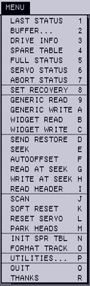

# NeoWidEx


NeoWidEx is a formatting and diagnostic utility for the Widget, a 10-megabyte
hard drive that Apple Computer designed and manufactured the 1980s. It runs on
the Apple Lisa 2/10 computer, the only computer Apple ever sold with a Widget
inside.

## Fair warning

NeoWidEx can easily destroy all of the data on your Widget, quickly and
permanently. It might even harm your Widget itself, even if it is used in a
cautious and sensible way. If you're not prepared to risk these consequences,
don't use NeoWidEx.

## Required reading

NeoWidEx is a powerful tool that issues low-level commands directly to a
Widget. To use NeoWidEx effectively, you need to know how a Widget works and
what these commands do.

The documentation that comes with NeoWidEx will not give you this knowledge on
its own. Get ready to use NeoWidEx by studying the [Widget ERS document](
http://bitsavers.trailing-edge.com/pdf/apple/disk/widget/Widget_ERS.pdf),
particularly PDF pages 81-135.

## System requirements

You can get started right away with NeoWidEx if you have:

- A working floppy drive (or a floppy drive emulator like [Floppy Emu](
  http://www.bigmessowires.com/floppy-emu/)).
- A Lisa 2 with ROM version H.

NeoWidEx will run on a Lisa 2/5 (i.e. a Lisa 2 with a built-in external
parallel port), but it will only be able to access drives attached to that
port. Most NeoWidEx options will be unavailable unless that drive is a Widget.

The [LisaEm](http://lisa.sunder.net) emulator will run NeoWidEx, although
because LisaEm does not emulate a Widget, many options will be unavailable.

#### Details

**Floppy drive:** Ordinary realisations of NeoWidEx will be loaded into RAM
from a floppy disk (or from a floppy drive emulator like Floppy Emu). Other
methods of starting NeoWidEx may be possible but have not been attempted.
NeoWidEx expects the Lisa's memory to be configured [as the Boot ROM arranges
it on startup](https://github.com/stpltn/bootloader#operational-description),
and NeoWidEx itself should be loaded into a contiguous memory region starting
at address $000800. NeoWidEx's code is not relocatable.

**ROM version H:** NeoWidEx performs some tasks by calling unpublished routines
in the Lisa's boot ROM. For this reason, a NeoWidEx built for one boot ROM
version will not work in a Lisa with a different boot ROM. At present. NeoWidEx
is developed on a Lisa with boot ROM version H, and the disk image available on
Github is ROM H specific.

If you know where to find the ROM routines NeoWidEx uses in a different ROM
version, and you know these ROM routines work the same way that their ROM H
counterparts do, all you'll need to do to make a custom NeoWidEx for your
ROM is

- change the `kBootRom` constant in [`NeoWidEx_DEFS.X68`](
  NeoWidEx_DEFS.X68).
- supply the addresses in a ROM-specific section of the same file (copy the
  idiom found within the `IFEQ (kBootRom-'H')` conditional.

## User interface notes

### Accessibility

NeoWidEx has poor accessibility for people with certain kinds of visual
impairments. Additionally, some people may have trouble reading the text
NeoWidEx prints to the screen, which makes use of the capital-letters-only
font in the Lisa's boot ROM. Other accessibility shortcomings may exist.

If you are having trouble using NeoWidEx due to any of these issues, please
[contact me via email](mailto:stepleton@gmail.com).

### Hexadecimal numbers

**All numbers displayed in NeoWidEx are hexadecimal numbers.**

### Forms

NeoWidEx uses forms to obtain numerical input from the user. A form is one or
more lines of text that look like this:

```
SEEK TO CYLINDER-⍰⍰⍰⍰ HEAD-01 SECTOR-0C
```

At any time when a form is active, the user may change the value for the field
marked with inverted question mark characters (drawn as `⍰` above).  The user
edits this value in an input box above the output window, where the arrow keys,
**Backspace**, and digits 0-9, A-F all work as expected. Typing **Tab** or
**Return** commits the edited value to the field and moves to the next field,
rotating back to the start after the end of the form is reached.

Type **Clear** or **Z** to restore the value in the current field to the value
it had when the form was initially presented.

Type **Q** to abandon the form and cancel the operation currently underway.

And finally, type **Enter** or **X** to submit the form and continue the
operation in progress.

## Main menu options



The NeoWidEx main menu presents the following menu options. The ones marked with
a star (:star:) are compatible with all Lisa parallel port hard drives.

#### :star: LAST STATUS

NeoWidEx presents the last **standard status** reported by the hard drive, along
with a bit-by-bit explanation of what the status means.

#### :star: BUFFER...

This menu option leads to the [Buffer submenu](#buffer-submenu).

#### :star: DRIVE INFO

NeoWidEx reads block `$FFFFFF` from the drive, a "virtual block" that contains
information about the drive's parameters (its "`Device_ID`" structure).
NeoWidEx parses and presents this data.

This command will not work on a Widget that has failed its self tests.

#### :star: SPARE TABLE

NeoWidEx reads block `$FFFFFE` from the drive, a "virtual block" that returns a
data structure describing the drive's **spare table** (in Widget's case at
least, this is the actual spare table data stored on disk). NeoWidEx parses and
presents the information in this data structure.

Within the LisaEm emulator, it is normal for NeoWidEx to observe that the
bad block table ends with a suspicious `$000000` value instead of the
expected `$FFFFFF`.

This command will not work on a Widget that has failed its self tests.

#### FULL STATUS

NeoWidEx executes the `Read_Controller_Status` command repeatedly to recover
all eight 32-bit controller status longwords from the Widget. It displays these
longwords along with a bit-by-bit explanation of what the longwords mean. The
first status longword is the standard status.

#### SERVO STATUS

NeoWidEx executes the `Read_Servo_Status` command repeatedly to recover all
eight 32-bit status longwords from the servo. These longwords are requested in
the reverse order of their identifying bytes, from `$08` to `$01`. This ensures
that status information pertaining to the last command processed by the servo
(servo status longword `$08`) won't simply refer to the commands executed to
retrieve the other seven status longwords.

NeoWidEx displays these longwords and attempts to show a bit-by-bit explanation
of what they mean, but the semantics of the servo status information are not
as well-documented or well-known as those of the controller status longwords.

#### ABORT STATUS

NeoWidEx executes the `Read_Abort_Status` command, whose result elaborates on
the failure condition encountered by the Widget while carrying out the last
command to be executed.  If there was no preceding failure condition (marked by
the least significant bit of the standard status), then the returned
information is not meaningful.

NeoWidEx attempts to decode the abort status information based on Appendix C of
the [Widget ERS document](
http://bitsavers.trailing-edge.com/pdf/apple/disk/widget/Widget_ERS.pdf), which
notes that the proper interpretation of this data is highly dependent on the
Widget's firmware version. As the ERS document appears to describe an earlier
firmware than what's available on my Widget, it's quite possible that
NeoWidEx will not interpret abort status information correctly for most
commercially-sold Widgets.

#### SET RECOVERY

This option allows the user to enable or disable the Widget's **recovery**
capability. With recovery enabled (the default), the Widget will attempt to
compensate for certain errors encountered whilst carrying out a command: for
example, if it fails to write data to a particular block, the Widget will save
the data in one of the Widget's spare blocks instead. With recovery disabled,
operations that encounter errors will abort without attempting any kind of
work-around.

Most serious diagnostic investigations will disable recovery to obtain more
precise control over the behaviour and side-effects of Widget commands.

#### :star: GENERIC READ

#### :star: GENERIC WRITE

#### WIDGET READ

#### WIDGET WRITE

Diag-Write might benefit from engaging ATF

Format might not issue a scan

## Acknowledgements

It would not have been possible for me to write NeoWidEx without the following
people and resources:

- [Dr. Patrick Schäfer](http://john.ccac.rwth-aachen.de:8000/patrick/index.htm),  whose numerous contributions include disassembly and/or analysis of various
  Widget ROMs, technical documentation from his various projects, and some
  helpful emails.
- [bitsavers.org](http://bitsavers.org)'s archived technical documentation.
- The [LisaEm](http://lisa.sunder.net) emulator by Ray Arachelian.
- The [Floppy Emu](http://www.bigmessowires.com/floppy-emu/) floppy drive
  emulator.
- The [BLU](http://sigmasevensystems.com/BLU.html) utility by James MacPhail
  and Ray Arachelian.
- The entire [LisaList](https://groups.google.com/forum/#!forum/lisalist)
  community.
