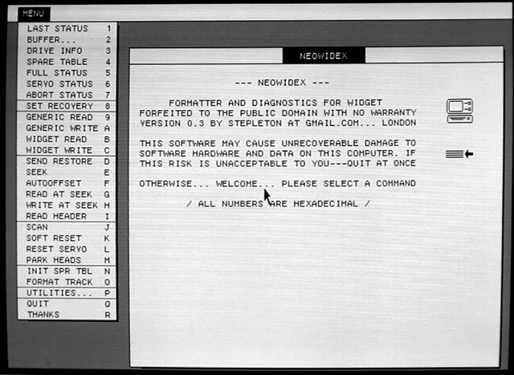

# NeoWidEx



NeoWidEx is a formatting and diagnostic utility for the Widget, a 10-megabyte
hard drive that Apple Computer designed and manufactured the 1980s. It runs on
the Apple Lisa 2/10 computer, the only computer Apple ever sold with a Widget
inside.

## Fair warning

NeoWidEx can easily destroy all of the data on your Widget, quickly and
permanently. It might even harm your Widget itself, even if it is used in a
cautious and sensible way. If you're not prepared to risk these consequences,
don't use NeoWidEx.

## Required reading

NeoWidEx is a powerful tool that issues low-level commands directly to a
Widget. To use NeoWidEx effectively, you need to know how a Widget works and
what these commands do.

The documentation that comes with NeoWidEx will not give you this knowledge on
its own. Get ready to use NeoWidEx by studying the [Widget ERS document](
http://bitsavers.trailing-edge.com/pdf/apple/disk/widget/Widget_ERS.pdf),
particularly PDF pages 81-135.

## System requirements

You can get started right away with NeoWidEx if you have:

- A working floppy drive (or a floppy drive emulator like [Floppy Emu](
  http://www.bigmessowires.com/floppy-emu/)).
- A Lisa 2 with ROM version H.

#### Details

**Floppy drive:** Ordinary realisations of NeoWidEx will be loaded into RAM
from a floppy disk (or from a floppy drive emulator like Floppy Emu). Other
methods of starting NeoWidEx may be possible but have not been attempted.
NeoWidEx expects the Lisa's memory to be configured [as the Boot ROM arranges
it on startup](https://github.com/stpltn/bootloader#operational-description),
and NeoWidEx itself should be loaded into a contiguous memory region starting
at address $000800. NeoWidEx's code is not relocatable.

**ROM version H:** NeoWidEx performs some tasks by calling unpublished routines
in the Lisa's boot ROM. For this reason, a NeoWidEx built for one boot ROM
version will not work in a Lisa with a different boot ROM. At present. NeoWidEx
is developed on a Lisa with boot ROM version H, and the disk image available on
Github is ROM H specific.

If you know where to find the ROM routines NeoWidEx uses in a different ROM
version, and you know these ROM routines work the same way that their ROM H
counterparts do, all you'll need to do to make a custom NeoWidEx for your
ROM is

- change the `kBootRom` constant in [`NeoWidEx_DEFS.X68`](
  NeoWidEx_DEFS.X68).
- supply the addresses in a ROM-specific section of the same file (copy the
  idiom found within the `IFEQ (kBootRom-'H')` conditional.

## User interface notes

### Hexadecimal numbers

**All numbers displayed in NeoWidEx are hexadecimal numbers.**

### Forms

NeoWidEx uses forms to obtain numerical input from the user. A form is one or
more lines of text that look like this:

```
SEEK TO CYLINDER-⍰⍰⍰⍰ HEAD-01 SECTOR-0C
```

At any time when a form is active, the user may change the value for the field
marked with inverted question mark characters (drawn as `⍰` above).  The user
edits this value in an input box above the output window, where the arrow keys,
**Backspace**, and digits 0-9, A-F all work as expected. Typing **Tab** or
**Return** commits the edited value to the field and moves to the next field,
rotating back to the start after the end of the form is reached.

Type **Clear** or **Z** to restore the value in the current field to the value
it had when the form was initially presented.

Type **Q** to abandon the form and cancel the operation currently underway.

And finally, type **Enter** or **X** to submit the form and continue the
operation in progress.

## Menu options

TODO

## Acknowledgements

It would not have been possible for me to write NeoWidEx without the following
people and resources:

- [Dr. Patrick Schäfer](http://john.ccac.rwth-aachen.de:8000/patrick/index.htm),  whose numerous contributions include disassembly and/or analysis of various
  Widget ROMs, technical documentation from his various projects, and some
  helpful emails.
- [bitsavers.org](http://bitsavers.org)'s archived technical documentation.
- The [LisaEm](http://lisa.sunder.net) emulator by Ray Arachelian.
- The [Floppy Emu](http://www.bigmessowires.com/floppy-emu/) floppy drive
  emulator.
- The [BLU](http://sigmasevensystems.com/BLU.html) utility by James MacPhail
  and Ray Arachelian.
- The entire [LisaList](https://groups.google.com/forum/#!forum/lisalist)
  community.
